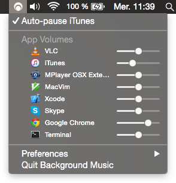

<!-- vim: set tw=120: -->


# Background Music
##### macOS audio utility



- Automatically pauses your music player when other audio starts playing and unpauses it afterwards
- Per-application volume, boost quiet apps
- Record system audio <br><br>
- No restart required to install
- Runs entirely in userspace

## Download

### Version 0.2.0

<a href="https://github.com/kyleneideck/BackgroundMusic/releases/download/v0.2.0/BackgroundMusic-0.2.0.pkg">
BackgroundMusic-0.2.0.pkg</a> (581 KB)

Still very much in alpha. Not code signed, so you'll have to **right-click it and choose "Open"**.

**Requires macOS 10.10+**. Should work on 10.9, but I haven't tried it.

> <sub>MD5: 23653c889f9ba7efc9cbb4e550c54060</sub><br/>
> <sub>SHA256: 78184ba743ba79e8cbd81bc8e2ea28b59100cc626ea77be58d6612bcfe2c7b78</sub><br/>
> <sub>PGP:
> [sig](https://github.com/kyleneideck/BackgroundMusic/releases/download/v0.2.0/BackgroundMusic-0.2.0.pkg.asc),
> [key (0595DF814E41A6F69334C5E2CAA8D9B8E39EC18C)](https://bearisdriving.com/kyle-neideck.gpg)</sub>

We also have [snapshot builds](https://github.com/kyleneideck/BackgroundMusic/releases).

### Or install using [Homebrew](https://brew.sh/)

```bash
brew cask install background-music
```

If you want the snapshot version:

```bash
brew tap homebrew/cask-versions
brew cask install background-music-pre
```

## Auto-pause music

Background Music can pause your music player app when other audio starts playing and unpause it afterwards. The idea is
that when I'm listening to music and pause it to watch a video or something I always forget to unpause it afterwards. So
this keeps me from wearing headphones for hours listening to nothing.

So far iTunes, [Spotify](https://www.spotify.com), [VLC](https://www.videolan.org/vlc/),
[VOX](https://coppertino.com/vox/mac), [Decibel](https://sbooth.org/Decibel/), [Hermes](http://hermesapp.org/) and
[Swinsian](https://swinsian.com/) are supported. Adding support for a new music player should only take a few
minutes<sup id="a1">[1](#f1)</sup> -- see [BGMMusicPlayer.h](BGMApp/BGMApp/Music%20Players/BGMMusicPlayer.h). If you
don't know how to program, or just don't feel like it, create an issue and I'll try to add it for you.

## App volumes

Background Music has a volume slider for each app running on the system. I mostly use this to boost quiet apps above
their normal maximum volume.

## Recording system audio

With Background Music running, open QuickTime Player and go `File > New Audio Recording...` (or movie/screen). Then
click the arrow next to the record button that looks like `⌄` and select `Background Music` as the input device.

You should be able to record system audio and a microphone together by creating an [aggregate
device](https://support.apple.com/en-us/HT202000) that combines your input device (usually Built-in Input) with
the Background Music device. You can create the aggregate device using the Audio MIDI Setup utility from
`/Applications/Utilities`.

## Install from source

Building should take less than a minute, but you'll need [Xcode](https://developer.apple.com/xcode/download/) version 
8 or higher.

If you're comfortable with it, you can just paste the following at a Terminal prompt.

<!--
Uses /bin/bash instead of just bash on the off chance that someone has a non standard Bash in their $PATH, but
it doesn't do that for Tar or cURL because I'm fairly sure any versions of them should work here. That said,
build_and_install.sh doesn't call most things by absolute paths yet anyway.

Uses "gzcat - | tar x" instead of "tar xz" because gzcat will also check the file's integrity (gzip files
include a checksum), which makes sure we can't run a half-downloaded copy of build_and_install.sh.
-->
```shell
(set -eo pipefail; URL='https://github.com/kyleneideck/BackgroundMusic/archive/master.tar.gz'; \
    cd $(mktemp -d); echo Downloading $URL to $(pwd); curl -qfL# $URL | gzcat - | tar x && \
    /bin/bash BackgroundMusic-master/build_and_install.sh -w && rm -rf BackgroundMusic-master)
```

Otherwise, to build and install from source:

- Clone or [download](https://github.com/kyleneideck/BackgroundMusic/archive/master.zip) the project.
- If the project is in a zip, unzip it.
- Open `Terminal.app` and [change directory](https://github.com/0nn0/terminal-mac-cheatsheet#core-commands) to the
  directory containing the project.
- Run the following command: `/bin/bash build_and_install.sh`.

The script restarts the system audio process (coreaudiod) at the end of the installation, so you might want to pause any
apps playing audio.

Additional detailed installation instructions can be found on [the
Wiki](https://github.com/kyleneideck/BackgroundMusic/wiki/Installation).

## Uninstall

- Run the `uninstall.sh` script (using `Terminal.app`) to remove Background Music from your system. You should be able
  to find it in `/Applications/Background Music.app/Contents/Resources/uninstall.sh`, but if not you can [download the
  project](https://github.com/kyleneideck/BackgroundMusic/archive/master.zip) again.
- Go to the Sound section in System Preferences and change your default output device at least once. (If you only have
  one device now, either use `Audio MIDI Setup.app` to create a temporary aggregate device, restart any audio apps that
  have stopped working or just restart your system.)

### Manual Uninstall

Try following the instructions in [`MANUAL-UNINSTALL.md`](MANUAL-UNINSTALL.md) if `uninstall.sh` fails. (You might
consider submitting a bug report, too.)

## Troubleshooting

If Background Music crashes and your audio stops working, open the Sound panel in System Preferences and change your
system's default output device to something other than the Background Music device. If it already is, it might help to
change the default device and then change it back again.

Failing that, you might have to uninstall. Consider filing a bug report if you do.

## Known issues

- Setting an app's volume above 50% can cause [clipping](https://en.wikipedia.org/wiki/Clipping_(audio)). Currently, the
  best solution is to instead set your overall volume to max and lower the volumes of other apps.
- VLC automatically pauses iTunes/Spotify when it starts playing something, but that stops Background Music from
  unpausing your music afterwards. To workaround it, open VLC's preferences, click `Show All`, go `Interface` > `Main
  interfaces` > `macosx` and change `Control external music players` to either `Do nothing` or `Pause and resume
  iTunes/Spotify`.

  Similarly, Skype pauses iTunes during calls. If you want to disable that, uncheck `Pause iTunes during calls` on the
  General tab of Skype's preferences.
- Plugging in or unplugging headphones when Background Music isn't running can silence system audio. To fix it, go to
  the Sound section in System Preferences, click the Output tab and change your default output device to something other
  than the Background Music device. Alternatively, you may Option+Click on the Sound icon in the menu bar to select a
  different output device.

  This happens when macOS remembers that the Background Music device was your default audio device the last time you
  last used (or didn't use) headphones.
- [A Chrome bug](https://bugs.chromium.org/p/chromium/issues/detail?id=557620) can stop Chrome from switching to the
  Background Music device after you open Background Music. Chrome's audio will still play, but Background Music won't be
  aware of it.
- Some apps play notification sounds that are only just long enough to trigger an auto-pause. The only workaround right
  now is to increase the `kPauseDelayNSec` constant in [BGMAutoPauseMusic.mm](/BGMApp/BGMApp/BGMAutoPauseMusic.mm).
  That will make your music overlap the other audio for longer, though, so you don't want to increase it too much. See
  [#5](https://github.com/kyleneideck/BackgroundMusic/issues/5) for details.
- Plenty more. Some are in listed in [TODO.md](/TODO.md).

## Related projects

- [Core Audio User-Space Driver
  Examples](https://developer.apple.com/library/mac/samplecode/AudioDriverExamples/Introduction/Intro.html)
  The sample code from Apple that BGMDriver is based on.
- [Soundflower](https://github.com/mattingalls/Soundflower) - "MacOS system extension that allows applications to pass
  audio to other applications."
- [WavTap](https://github.com/pje/WavTap) - "globally capture whatever your mac is playing—-as simply as a screenshot"
- [eqMac](http://www.bitgapp.com/eqmac/), [GitHub](https://github.com/nodeful/eqMac2) - "System-wide Audio Equalizer for the Mac"
- [llaudio](https://github.com/mountainstorm/llaudio) - "An old piece of work to reverse engineer the Mac OSX
  user/kernel audio interface. Shows how to read audio straight out of the kernel as you would on Darwin (where most the
  OSX goodness is missing)"
- [mute.fm](http://www.mute.fm), [GitHub](https://github.com/jaredsohn/mutefm) (Windows) - Auto-pause music
- [Jack OS X](http://www.jackosx.com) - "A Jack audio connection kit implementation for Mac OS X"
- [PulseAudio OS X](https://github.com/zonque/PulseAudioOSX) - "PulseAudio for Mac OS X"
- [Sound Pusher](https://github.com/q-p/SoundPusher) - "Virtual audio device, real-time encoder and SPDIF forwarder for
  Mac OS X"
- [Zirkonium](https://code.google.com/archive/p/zirkonium) - "An infrastructure and application for multi-channel sound
  spatialization on MacOS X."

### Non-free

- [Audio Hijack](https://rogueamoeba.com/audiohijack/) - "Capture Audio From Anywhere on Your Mac"
- [Sound Siphon](https://staticz.com/soundsiphon/), [Sound Control](https://staticz.com/soundcontrol/) - System/app audio recording, per-app volumes, system audio equaliser
- [SoundBunny](https://www.prosofteng.com/soundbunny-mac-volume-control/) - "Control application volume independently."
- [Boom 2](http://www.globaldelight.com/boom/index.php) - "The Best Volume Booster & Equalizer For Mac"

## License

Copyright © 2016-2019 [Background Music contributors](https://github.com/kyleneideck/BackgroundMusic/graphs/contributors).
Licensed under [GPLv2](https://www.gnu.org/licenses/gpl-2.0.html), or any later version.

Background Music includes code from:

- [Core Audio User-Space Driver
  Examples](https://developer.apple.com/library/mac/samplecode/AudioDriverExamples/Introduction/Intro.html), [original
  license](LICENSE-Apple-Sample-Code), Copyright (C) 2013 Apple Inc. All Rights Reserved.
- [Core Audio Utility
  Classes](https://developer.apple.com/library/content/samplecode/CoreAudioUtilityClasses/Introduction/Intro.html),
  [original license](LICENSE-Apple-Sample-Code), Copyright (C) 2014 Apple Inc. All Rights Reserved.

----

<b id="f1">[1]</b> However, if the music player doesn't support AppleScript, or doesn't support the events Background
Music needs (`isPlaying`, `isPaused`, `play` and `pause`), it can take significantly more effort to add. (And in some
cases would require changes to the music player itself.) [↩](#a1)


